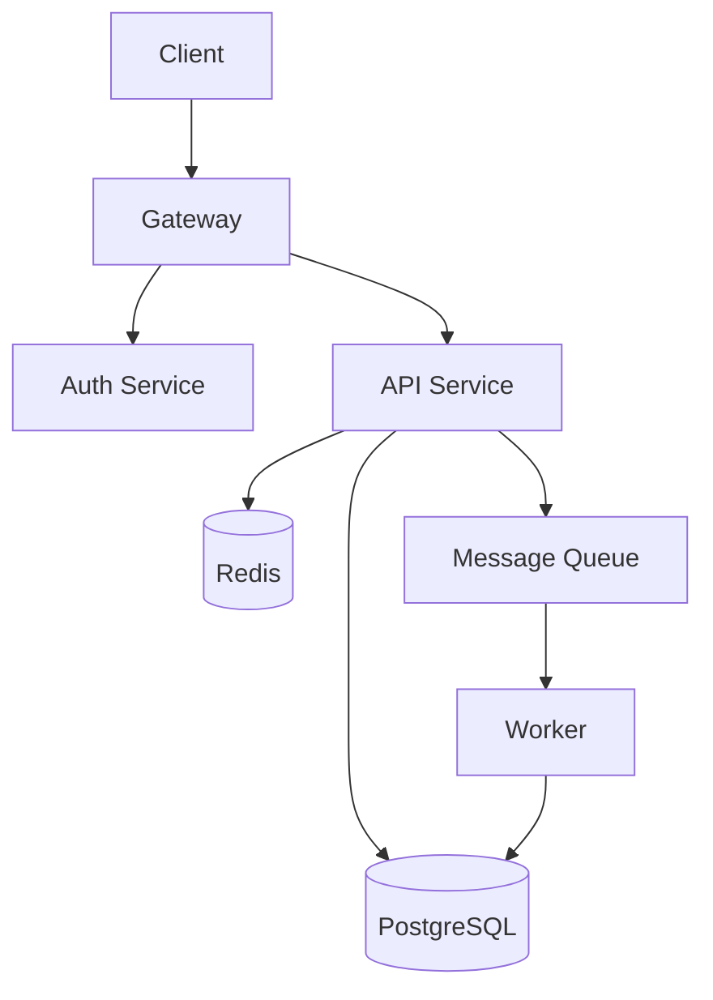
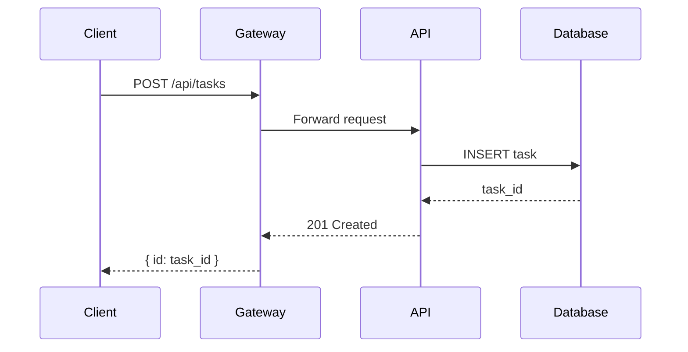
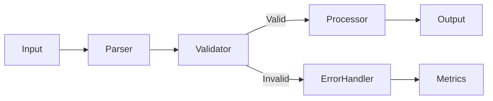

# Documentation Architect

## Purpose

Create and maintain high-quality technical documentation: architecture diagrams, API docs, runbooks, and ADRs.

## Document Types & Templates

### README Template (for any project)

```markdown
# Project Name

One-line description.

## Quick Start

Three or fewer commands to run the project.

## Architecture

Mermaid diagram or brief description.

## Configuration

Table of environment variables / config keys.

## Development

How to build, test, lint.

## Deployment

How to deploy to production.
```

### Architecture Decision Record (ADR)

```markdown
# ADR-NNN: Decision Title

## Status: Proposed | Accepted | Deprecated | Superseded

## Context

What is the issue or need driving this decision?

## Decision

What has been decided?

## Consequences

What are the trade-offs of this decision?
```

### Runbook Template

```markdown
# Runbook: Service Recovery

## Symptoms

- Metric X drops below threshold
- Error rate exceeds N%

## Diagnosis

1. Check logs: `kubectl logs -l app=service`
2. Check metrics: Grafana dashboard URL

## Resolution Steps

1. Step one with exact command
2. Step two with expected output

## Escalation

Contact: @team-lead, #ops-channel
```

## Mermaid Diagrams (ALWAYS use for architecture)

### System Architecture



### Sequence Diagram



### Data Flow



## Writing Rules

1. **Lead with the action**: "Run `pnpm test`" not "You can run tests by..."
2. **Use tables** for configuration, not paragraphs
3. **Use code blocks** for all commands and file paths
4. **Keep paragraphs to 3 sentences max**
5. **Use numbered lists** for steps, bullets for features
6. **Include expected output** for all commands
7. **Date stamp ADRs** and link to related issues
8. **No passive voice**: "The service handles..." not "Requests are handled by..."
